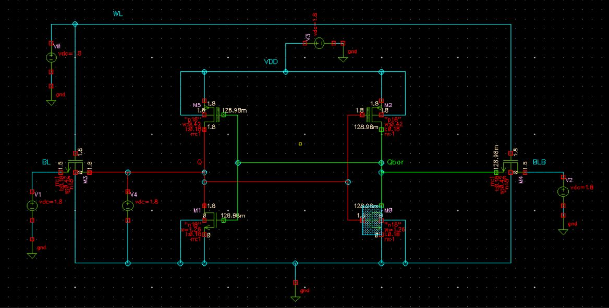
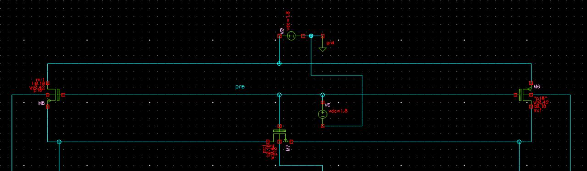
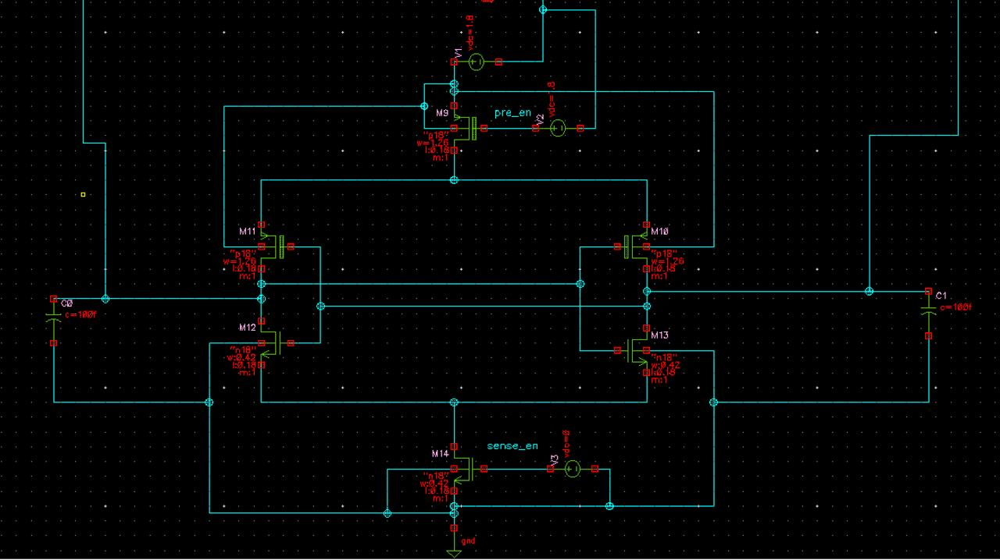
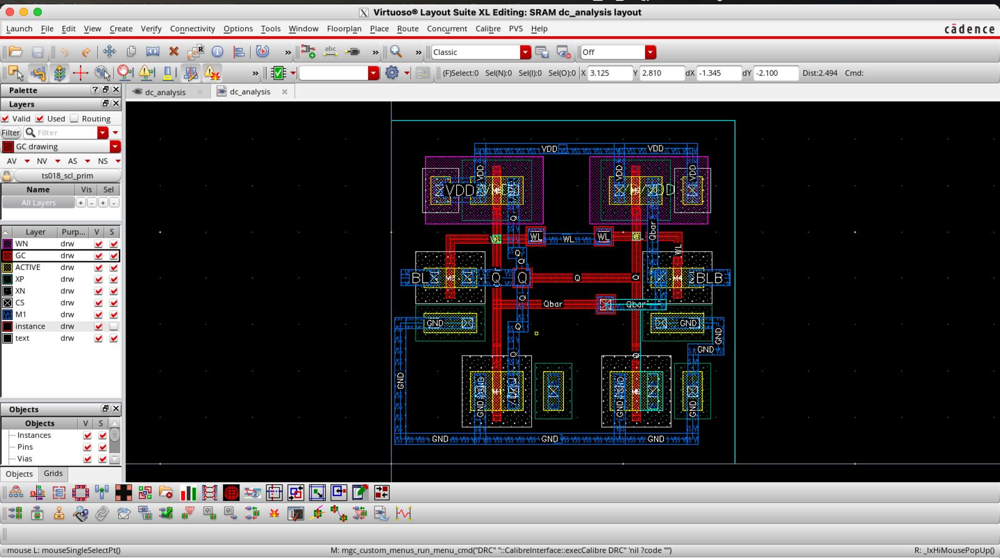
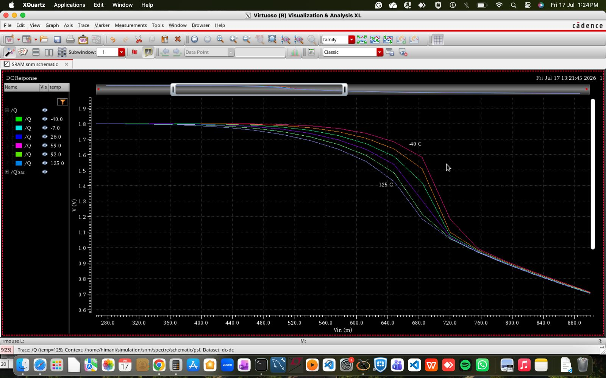
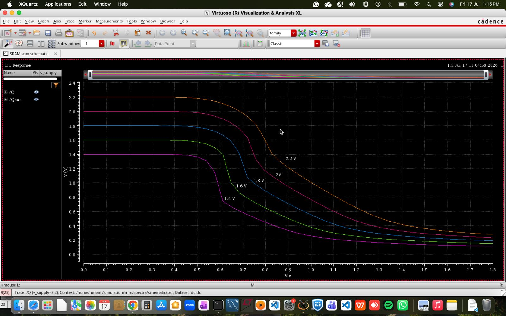

# 6T SRAM Cell Design, SNM Optimization & Layout Analysis


## 📌 Abstract / Overview
This repository contains the end-to-end design, layout, mathematical derivation, and characterization of a **6-Transistor (6T) SRAM Cell** operating at **$V_{DD} = 1.8\text{ V}$**. 

The project includes:
- Complete schematic implementation of the **6T SRAM Cell**, **Precharge Circuit**, and **Sense Amplifier**.
- DRC/LVS clean physical layout design.
- Rigorous mathematical modeling for **Cell Ratio (CR)** and **Pull-up Ratio (PR)**.
- **Static Noise Margin (SNM)** extraction using custom Python scripts for maximum embedded square fit on Butterfly Curves.
- Sensitivity analysis across **Voltage and Temperature** variations.

---

## 📐 1. Circuit Design & Physical Layout

The memory sub-system consists of a standard 6T SRAM cell optimized for balanced Read/Write stability, accompanied by peripheral precharge logic and a voltage-based Sense Amplifier for fast read operations.

### 🖼️ Circuit Schematics
> **6T SRAM Cell Schematic**  
>   
> *Figure 1.1: 6T SRAM Cell Schematic in Cadence Virtuoso.*

> **Peripheral Circuits (Precharge & Sense Amplifier)**  
>   
> *Figure 1.2(a): Precharge Circuit.*
>
>    
> *Figure 1.2(a): Voltage Sense Amplifier.*

> **Complete SRAM Schematic**
>   
> *Figure 1.3: Complete SRAM schematic with basic 6T cell, sense amplifier and precharge circuit.*

---

### 🎨 Physical Layout Design
The layout was drawn adhering to 180nm design rules (DRC clean) and verified using Layout vs. Schematic (LVS).

>   
> *Figure 1.4: DRC & LVS Verified 6T SRAM Layout.*

---

## 🧮 2. Theoretical Derivations: Cell Ratio (CR) & Pull-Up Ratio (PR)

To guarantee **Read Stability** (preventing unintentional flips) and **Write Ability** (forcing a bit-flip during write), the transistor sizing constraints are analytically derived using KCL and MOSFET current equations ($I_{DS}$).

### Summary Results & Governing Equations:
1. **Read Stability Constraint (Cell Ratio - CR):**
   $$\text{CR} = \frac{(W/L)_{N1}}{(W/L)_{A1}} \ge 1.25$$
   - Derived by balancing Access Transistor ($A_1$) and Drive Transistor ($N_1$) currents in linear/saturation regions ($I_{A1} = I_{N1}$).

2. **Write Stability Constraint (Pull-Up Ratio - PR):**
   $$\text{PR} = \frac{(W/L)_{P1}}{(W/L)_{A1}} \le 1.0$$
   - Derived by ensuring the Access Transistor ($A_1$) can overdrive the Pull-Up PMOS ($P_1$) ($I_{A1} = I_{P1}$).

> **Derivation Summary & Formulas Snapshot**  
>   
> *Figure 2.1: Key analytical equations and condition boundaries for CR and PR.*

📄 **For Complete Step-by-Step Derivations:**  
👉 **[Read Full Mathematical Derivation Report (PDF)](./reports/CR_PR_Mathematical_Derivation.pdf)**

---

## 📈 3. Static Noise Margin (SNM) Analysis

Static Noise Margin is analyzed using DC voltage sweep simulations to generate **Butterfly Curves**. A dedicated Python script rotates the VTC curves by $45^\circ$ to find the maximum embedded square for exact RSNM and WSNM values.

### Butterfly Curves & Python SNM Extraction
>   
> *Figure 3.1: Python-extracted Maximum Embedded Square inside the Butterfly Curve.*

---

### Parameter Sweeps: RSNM & WSNM Optimization

* **Read SNM (RSNM) vs. Cell Ratio (CR):** Swept $CR$ from $1.0 \rightarrow 3.0$. Higher $CR$ lowers voltage degradation at node $Q$ during read.
  * **Result:** $RSNM$ improved from **$208.7\text{ mV}$** ($CR = 1.0$) to **$370.7\text{ mV}$** ($CR = 3.0$).
* **Write SNM (WSNM) vs. Pull-Up Ratio (PR):** Swept $PR$ from $0.52 \rightarrow 1.43$. Lower $PR$ makes write operation significantly easier.

> **CR & PR Sweeps Visualization**  
>   
> *Figure 3.2: Effect of CR sweep on RSNM and PR sweep on WSNM.*

📄 **For Detailed SNM Plots & Python Extraction Code:**  
👉 **[View SNM Analysis Report (PDF)](./reports/SNM_Analysis_Report.pdf)**

---

## 🌡️ 4. PVT Sensitivity Analysis

The stability of the SRAM cell was tested under environmental and supply fluctuations:

1. **Temperature Variations:** Swept from $-40^\circ\text{C}$ to $125^\circ\text{C}$.  
2. **Voltage Variations ($V_{DD}$):** Swept from $1.2\text{V}$ to $2.0\text{V}$.

> **Temperature Variation Analysis**  
>   
> *Figure 4.1: RSNM vs Temperature sweep.*

> **Supply Voltage ($V_{DD}$) Variation Analysis**  
>   
> *Figure 4.2: SNM degradation at lower VDD levels.*

---

## 📊 5. Summary of Results

| Parameter | Condition / Value | Remarks |
| :--- | :--- | :--- |
| **Technology Node** | 180nm CMOS | Cadence Virtuoso / GPDK180 |
| **Supply Voltage ($V_{DD}$)** | $1.8\text{ V}$ | Nominal |
| **Cell Ratio ($CR$) Sweep** | $1.0 \rightarrow 3.0$ | $RSNM$ increases from **$208.7\text{ mV} \rightarrow 370.7\text{ mV}$** |
| **Pull-Up Ratio ($PR$) Sweep**| $0.52 \rightarrow 1.43$ | Lower $PR$ ensures write capability |
| **Temperature Range** | $-40^\circ\text{C}$ to $125^\circ\text{C}$ | Verified stability across limits |
| **Layout Area Verification** | DRC & LVS Clean | Zero errors |

---

## 🚀 6. Future Scope / Work in Progress
- [ ] Transient Power Dissipation (Dynamic & Standby Leakage Power extraction).
- [ ] Read/Write Delay characterization across process corners (FF, SS, TT).
- [ ] Monte Carlo statistical analysis for process mismatch impact on SNM.

---

## 🛠️ Tools & Technologies Used
* **EDA Tool:** Cadence Virtuoso (Schematic Editor, Layout Suite, Spectre Circuit Simulator)
* **Scripting / Data Analysis:** Python (NumPy, Matplotlib, SciPy for Butterfly Curve Rotation & Fitting)
* **Documentation:** LaTeX / PDF Reports

---

## 📁 Repository Structure
```text
├── docs/
│   ├── images/                # All schematics, layouts, and plot screenshots
│   └── reports/               # Detailed PDF reports for Math Derivations & Analysis
├── python/
│   └── snm_fitting.py         # Python script to extract maximum embedded square
├── cadence/
│   └── sram_6t_virtuoso/      # Schematic & Symbol files (Cadence library format)
└── README.md                  # Main Documentation
