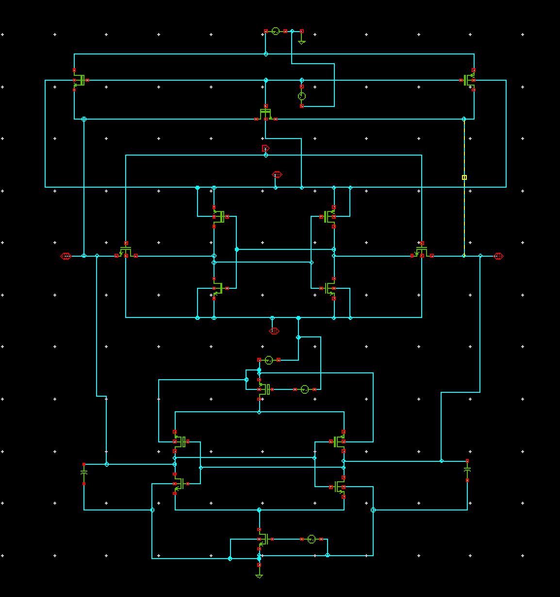
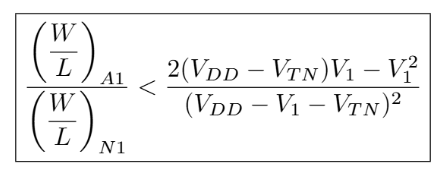
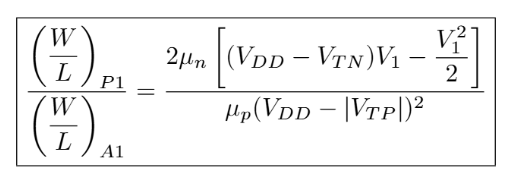
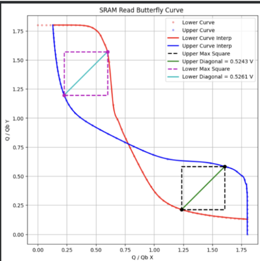
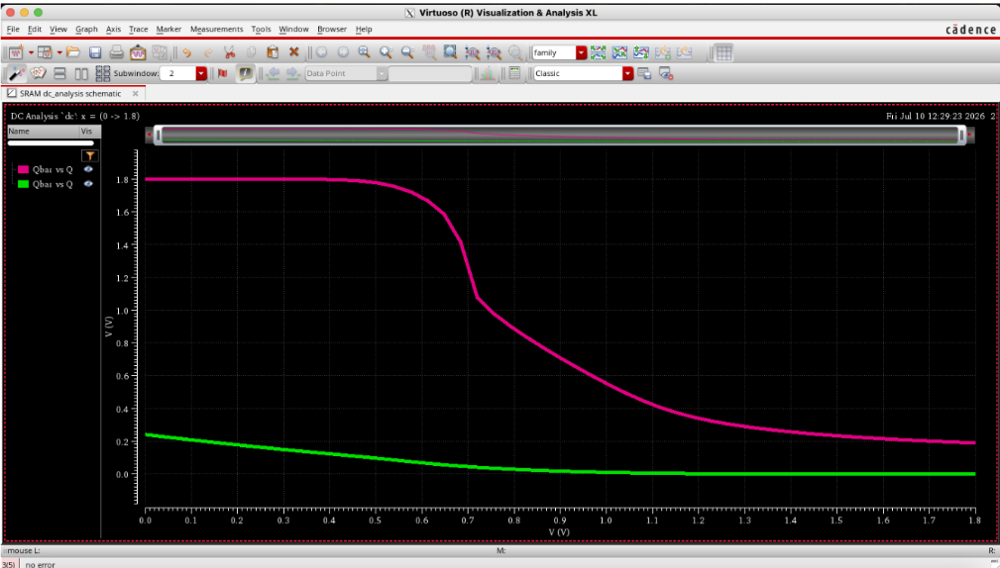
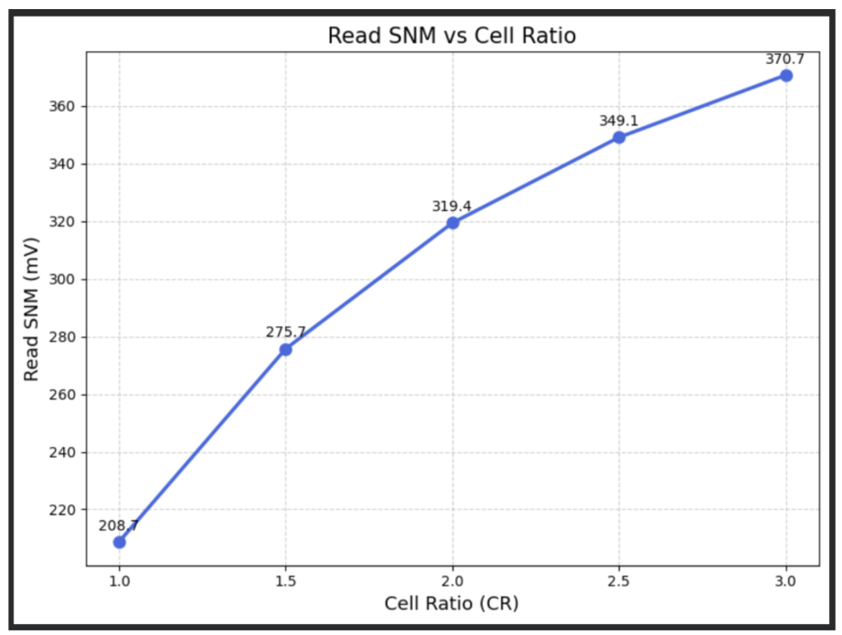
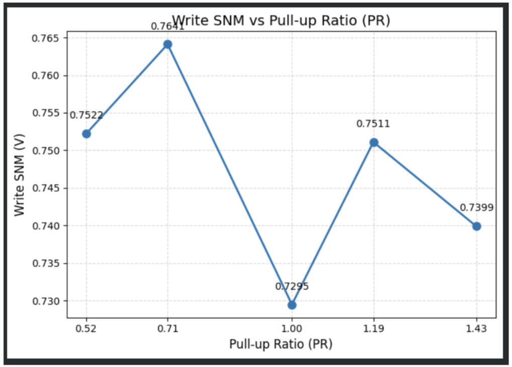
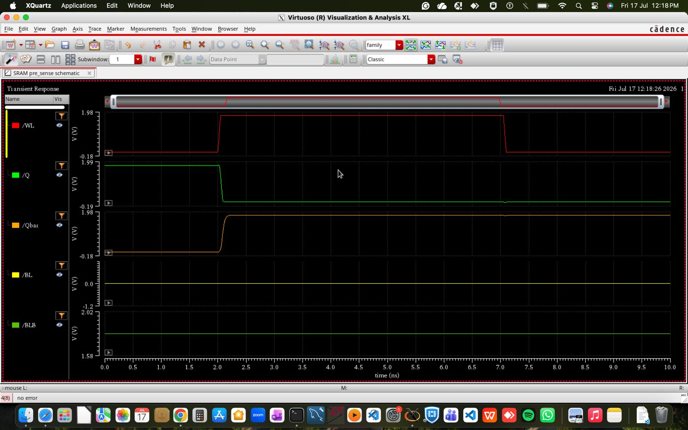
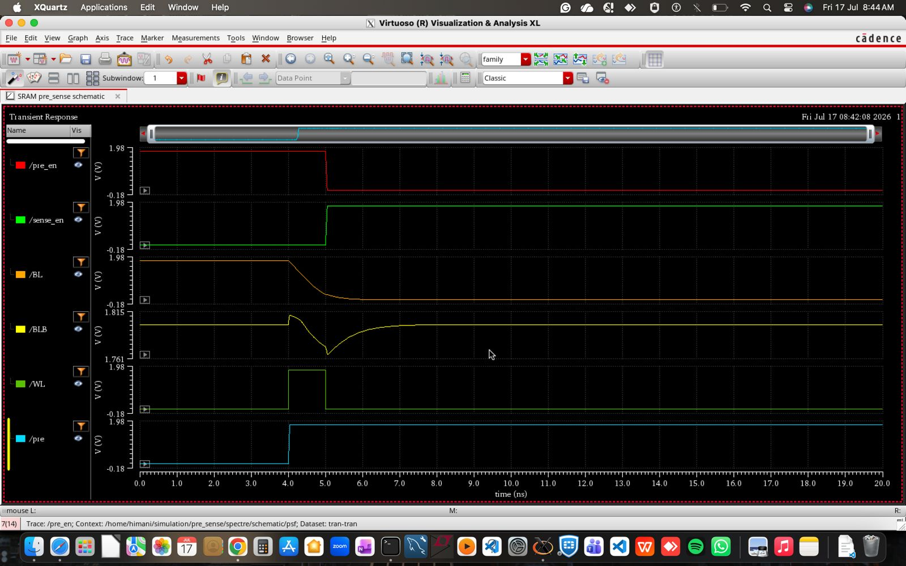

# 6T SRAM Cell Design, SNM Characterization & Layout Analysis

## Abstract / Overview
This repository contains the end-to-end design, layout, mathematical derivation, and characterization of a **6-Transistor (6T) SRAM Cell** operating at **$V_{DD} = 1.8\text{ V}$**. 

The project includes:
- Complete schematic implementation of the **6T SRAM Cell**, **Precharge Circuit**, and **Sense Amplifier**.
- Physical layout design.
- Rigorous mathematical modeling for **Cell Ratio (CR)** and **Pull-up Ratio (PR)**.
- **Static Noise Margin (SNM)** extraction using custom Python scripts for maximum embedded square fit on Butterfly Curves.
- Sensitivity analysis across **Voltage and Temperature** variations.

---

## 1. Circuit Design & Physical Layout

The memory sub-system consists of a standard 6T SRAM cell optimized for balanced Read/Write stability, accompanied by peripheral precharge logic and a voltage-based Sense Amplifier for fast read operations.

### Circuit Schematics
> **6T SRAM Cell Schematic**  
>   
> *Figure 1.1: 6T SRAM Cell Schematic in Cadence Virtuoso.*

> **Peripheral Circuits (Precharge & Sense Amplifier)**  
>   
> *Figure 1.2(a): Precharge Circuit. The precharge circuit initializes the bitlines to a known voltage level before a read operation. Equalizing the bitline pair establishes identical initial conditions, allowing a small differential voltage generated by the SRAM cell to be reliably detected during read access.*
>
>    
> *Figure 1.2(b): Voltage Sense Amplifier. The voltage sense amplifier detects the small differential voltage developed between (BL) and (BLB) during a read operation and amplifies it to a full-swing logic output. This enables faster and more reliable readout without requiring the SRAM cell itself to generate a large bitline voltage difference.*

> **Complete SRAM Schematic**
>   
> *Figure 1.3: Complete SRAM schematic with basic 6T cell, sense amplifier and precharge circuit. The complete SRAM test structure integrates the 6T storage cell with the precharge circuitry and voltage sense amplifier. Together, these blocks implement the essential storage and readout path required to verify functional SRAM read and write operations.*

---

### Physical Layout Design
The layout was drawn adhering to 180nm design rules.

>   
> *Figure 1.4: 6T SRAM Layout.*

---

## 2. Theoretical Derivations: Cell Ratio (CR) & Pull-Up Ratio (PR)

To guarantee **Read Stability** (preventing unintentional flips) and **Write Ability** (forcing a bit-flip during write), the transistor sizing constraints are analytically derived using KCL and MOSFET current equations ($I_{DS}$).

### Summary Results & Governing Equations:
1. **Read Stability Constraint (Cell Ratio - CR):**
   -  
   - Derived by balancing Access Transistor ($A_1$) and Drive Transistor ($N_1$) currents in linear/saturation regions ($I_{A1} = I_{N1}$).

2. **Write Stability Constraint (Pull-Up Ratio - PR):**
   - 
   - Derived by ensuring the Access Transistor ($A_1$) can overdrive the Pull-Up PMOS ($P_1$) ($I_{A1} = I_{P1}$).

 **For Complete Step-by-Step Derivations:**  
   - **[Full Mathematical Derivation Report for cell ratio (CR) ](read_stability_cell_ratio_derivation.pdf)**
   - **[Full Mathematical Derivation Report for pull-up ratio (PR) ](write_stability_pull_up_ratio_derivation.pdf)**

---

## 3. Static Noise Margin (SNM) Analysis

Static Noise Margin is analyzed using DC voltage sweep simulations to generate **Butterfly Curves**. A dedicated Python script finds the maximum embedded square for exact RSNM and WSNM values.

### Butterfly Curves & Python SNM Extraction
>   
> *Figure 3.1: Python-extracted Maximum Embedded Square inside the Butterfly Curve.*
>
>   
> *Figure 3.2: Python-extracted Maximum Embedded Square inside the WSNM Curve.*

---

### Parameter Sweeps: RSNM & WSNM Optimization

* **Read SNM (RSNM) vs. Cell Ratio (CR):** Swept $CR$ from $1.0 \rightarrow 3.0$. Higher $CR$ lowers voltage degradation at node $Q$ during read.
  * **Result:** $RSNM$ improved from **$208.7\text{ mV}$** ($CR = 1.0$) to **$370.7\text{ mV}$** ($CR = 3.0$).
* **Write SNM (WSNM) vs. Pull-Up Ratio (PR):** Swept $PR$ from $0.52 \rightarrow 1.43$. Lower $PR$ makes write operation significantly easier.

> **CR & PR Sweeps Visualization**  
>   
> *Figure 3.3: Effect of CR sweep on RSNM. Increasing the Cell Ratio strengthens the pull-down NMOS relative to the access transistor, reducing the voltage disturbance at the internal storage node during a read operation. Consequently, the Read SNM increases with CR, demonstrating improved read stability, with the highest evaluated RSNM obtained at (CR = 3).*
>
>   
> *Figure 3.4: Effect of PR sweep on WSNM. The Pull-Up Ratio sweep evaluates the effect of relative pull-up and access-transistor strengths on write stability. In general, a weaker pull-up PMOS relative to the access transistor improves write ability; however, the extracted WSNM also depends on the nonlinear transistor characteristics and operating point, resulting in a non-monotonic variation across the simulated PR values.*

 **For Detailed SNM Plots report (depicting cr and pr variations):**  
   - **[SNM Analysis Report (PDF)](snm_analysis.pdf)**

---

# 4. Final Transistor Sizing Based on Stability Analysis

Based on the read and write stability characterization, the following transistor dimensions were selected:

| Transistor | Width |
|---|---:|
| Access NMOS | 0.42 µm |
| Pull-Down NMOS | 1.26 µm |
| Pull-Up PMOS | 0.30 µm |

Corresponding sizing ratios:

**Cell Ratio (CR) = 3**

**Pull-Up Ratio (PR) ≈ 0.71**

The selected sizing provides a design point with strong read stability while maintaining reliable write ability for the simulated operating conditions.

---

## 5. Read and Write operation verification

> **Writing a 0 to the SRAM cell:** 
>   
> *Figure 5.1 (a): Write 0 operation. During the Write ‘0’ operation, the complementary bitlines are driven to the required logic levels (Here, since we are writing a logic 0, we give BL = 0 V and BLB = VDD) and the wordline is asserted to enable the access transistors. The low bitline forces the corresponding internal storage node toward ground, causing the cross-coupled inverters to switch and successfully store logic ‘0’.*

> **Writing a 1 to the SRAM cell:**  
>   
> *Figure 5.1 (b): Write 1 operation. During the Write ‘1’ operation, the bitline values are reversed (Hence, BL = VDD and BLB = 0 V) and the wordline is asserted to connect the storage nodes to the bitlines. The cell state switches accordingly and remains latched after the wordline is deasserted, confirming successful storage of logic ‘1’.*

>  **Reading the SRAM cell:**
>   
> *Figure 5.2: Read operation. During the Read operation, the bitlines are initially precharged and the wordline is asserted, connecting the internal storage nodes to the bitline pair through the access transistors. Depending on the data already stored at (Q) and (Qbar), a small differential voltage develops between (BL) and (BLB). The sense amplifier detects and amplifies this differential to obtain the corresponding logic output while preserving the stored state of the SRAM cell.*

## 6. Voltage - Temperature Sensitivity Analysis

The stability of the SRAM cell was tested under environmental and supply fluctuations:

1. **Temperature Variations:** Swept from $-40^\circ\text{C}$ to $125^\circ\text{C}$.  
2. **Voltage Variations ($V_{DD}$):** Swept from $1.2\text{V}$ to $2.0\text{V}$.

> **Temperature Variation Analysis**  
>   
> *Figure 6.1: Effect of temperature variation on SNM. As temperature increases, the Static Noise Margin generally decreases, indicating reduced SRAM cell stability at higher temperatures. Temperature-dependent variations in carrier mobility, threshold voltage, and transistor drive strength modify the voltage-transfer characteristics of the cross-coupled inverters, reducing the cell’s tolerance to noise and disturbances.*

> **Supply Voltage ($V_{DD}$) Variation Analysis**  
>   
> *Figure 6.2: Effect of supply voltage variation on SNM. As the supply voltage ((V_{DD})) increases, the Static Noise Margin increases, indicating improved SRAM cell stability. A higher supply voltage provides greater voltage headroom and stronger regenerative action in the cross-coupled inverters, increasing the cell’s tolerance to noise. Conversely, at lower (V_{DD}), reduced transistor drive strength and smaller voltage margins make the stored state more susceptible to disturbances, resulting in lower SNM.*

---

## 7. Summary of Results

| Parameter | Condition / Value | Remarks |
| :--- | :--- | :--- |
| **Technology Node** | 180nm CMOS | Cadence Virtuoso / TS018/SCL 180 nm PDK|
| **Supply Voltage ($V_{DD}$)** | $1.8\text{ V}$ | Nominal |
| **Cell Ratio ($CR$) Sweep** | $1.0 \rightarrow 3.0$ | $RSNM$ increases from **$208.7\text{ mV} \rightarrow 370.7\text{ mV}$** |
| **Pull-Up Ratio ($PR$) Sweep**| $0.52 \rightarrow 1.43$ | Evaluated impact of pull-up strength on write stabilityy |
| **Temperature Range** | $-40^\circ\text{C}$ to $125^\circ\text{C}$ | Characterized SNM stability across temperature range |
| **Supply Voltage Sweep** | 1.2 V → 2.0 V | Characterized SNM dependence on supply voltage |

---

## 8. Future Scope / Work in Progress
- [ ] Transient Power Dissipation (Dynamic & Standby Leakage Power extraction).
- [ ] Read/Write Delay characterization across process corners (FF, SS, TT).

---

## 9. Tools & Technologies Used
* **EDA Tool:** Cadence Virtuoso (Schematic Editor, Layout Suite, Spectre Circuit Simulator)
* **Scripting / Data Analysis:** Python (NumPy, Matplotlib, SciPy for Butterfly Curve Rotation & Fitting)
* **Documentation:** LaTeX / PDF Reports

---
## 10. Conclusion

A complete 6T SRAM cell was designed and characterized in Cadence Virtuoso using 180 nm CMOS technology at a nominal supply voltage of (1.8,\text{V}). The project combined transistor-level circuit design, analytical sizing, physical layout, functional verification, and stability characterization to study the major design trade-offs involved in SRAM operation.

Read and write stability were investigated through Cell Ratio (CR) and Pull-Up Ratio (PR) analysis, supported by mathematical derivations and SNM extraction from simulated voltage-transfer characteristics. The CR sweep demonstrated an improvement in RSNM from approximately (208.7,\text{mV}) at (CR=1) to (370.7,\text{mV}) at (CR=3). Based on the overall characterization, transistor widths of (0.42,\mu\text{m}) for the access NMOS, (1.26,\mu\text{m}) for the pull-down NMOS, and (0.30,\mu\text{m}) for the pull-up PMOS were selected, corresponding to (CR=3) and (PR\approx0.71).

Functional simulations verified Write ‘0’, Write ‘1’, and Read operations using the SRAM cell together with the precharge and sense-amplifier circuitry. Voltage and temperature sweeps were additionally performed to evaluate the sensitivity of cell stability to operating conditions. Overall, the project demonstrates an end-to-end SRAM design and characterization methodology, connecting analytical transistor sizing with circuit simulation, SNM-based stability evaluation, peripheral circuitry, and physical layout implementation.

